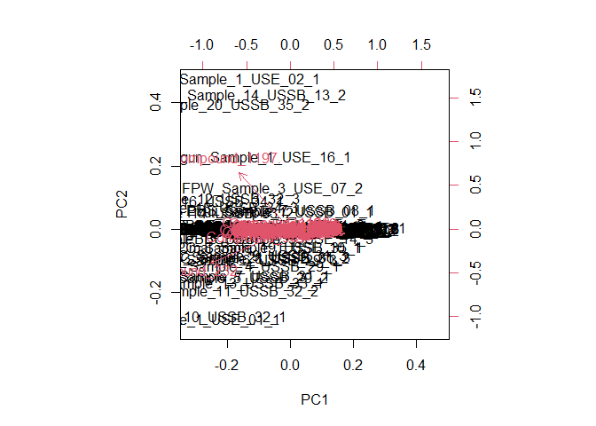
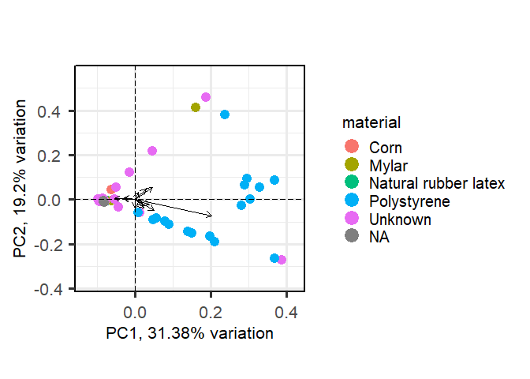
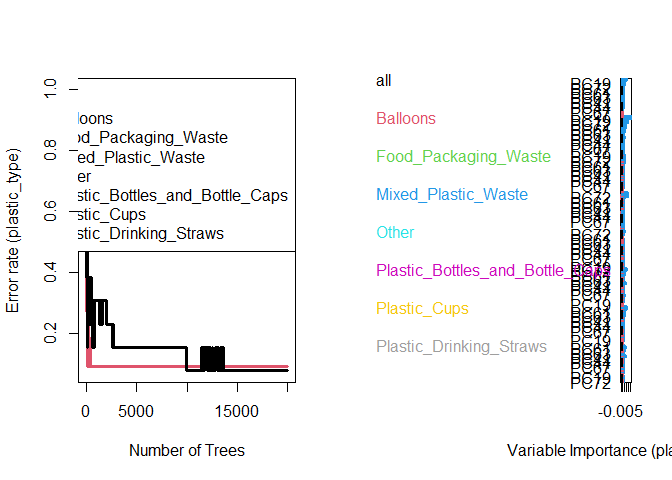
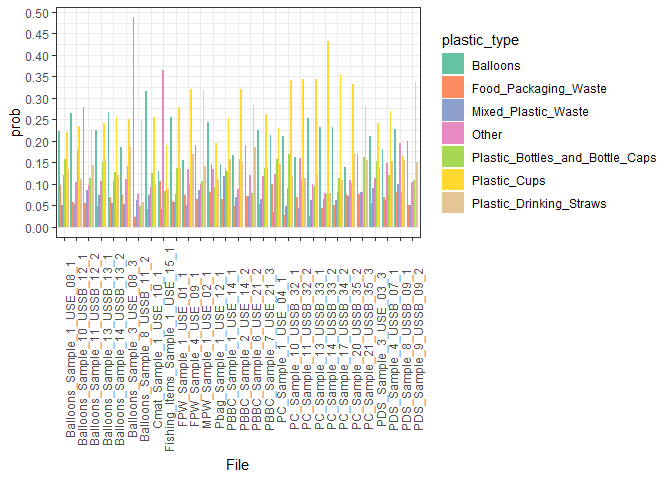

# Microplastic-Fingerprinting

## Documentation

This repo is accompanying the publication: “Computational fingerprinting
workflow for environmental source tracking of microplastic based on
representative additives”

Demo of each ML algorithms is shown below.

## Data processing

You can include R code in the document as follows:

    ## Warning in as.Date(as.numeric(sampleinfo$`Collection Date (YYYY-MM-DD)`), : NAs
    ## introduced by coercion

## Demo PCA

    ## Loading required package: ggrepel

    ## 
    ## Attaching package: 'PCAtools'

    ## The following objects are masked from 'package:stats':
    ## 
    ##     biplot, screeplot

    ## `summarise()` has grouped output by 'File'. You can override using the
    ## `.groups` argument.
    ## `summarise()` has grouped output by 'File'. You can override using the
    ## `.groups` argument.

## Demo RF + GBM

### With all samples

#### PCAtools

    ## 
    ##  randomForestSRC 3.2.2 
    ##  
    ##  Type rfsrc.news() to see new features, changes, and bug fixes. 
    ## 

    ## 
    ## Attaching package: 'randomForestSRC'

    ## The following object is masked from 'package:purrr':
    ## 
    ##     partial

    ##                          Sample size: 47
    ##            Frequency of class labels: 11, 3, 3, 5, 6, 13, 6
    ##                      Number of trees: 20000
    ##            Forest terminal node size: 1
    ##        Average no. of terminal nodes: 28.6001
    ## No. of variables tried at each split: 9
    ##               Total no. of variables: 77
    ##        Resampling used to grow trees: swr
    ##     Resample size used to grow trees: 47
    ##                             Analysis: RF-C
    ##                               Family: class
    ##                       Splitting rule: auc *random*
    ##        Number of random split points: 10
    ##                    (OOB) Brier score: 0.1070575
    ##         (OOB) Normalized Brier score: 0.87430294
    ##                            (OOB) AUC: 0.54327247
    ##    (OOB) Requested performance error: 0.55319149, 0.09090909, 1, 1, 1, 1, 0.15384615, 1
    ## 
    ## Confusion matrix:
    ## 
    ##                                  predicted
    ##   observed                        Balloons Food_Packaging_Waste
    ##   Balloons                              10                    0
    ##   Food_Packaging_Waste                   1                    0
    ##   Mixed_Plastic_Waste                    3                    0
    ##   Other                                  2                    0
    ##   Plastic_Bottles_and_Bottle_Caps        1                    0
    ##   Plastic_Cups                           1                    0
    ##   Plastic_Drinking_Straws                1                    0
    ##                                  predicted
    ##   observed                        Mixed_Plastic_Waste Other
    ##   Balloons                                          0     0
    ##   Food_Packaging_Waste                              0     0
    ##   Mixed_Plastic_Waste                               0     0
    ##   Other                                             0     0
    ##   Plastic_Bottles_and_Bottle_Caps                   0     0
    ##   Plastic_Cups                                      0     0
    ##   Plastic_Drinking_Straws                           0     0
    ##                                  predicted
    ##   observed                        Plastic_Bottles_and_Bottle_Caps Plastic_Cups
    ##   Balloons                                                      0            1
    ##   Food_Packaging_Waste                                          0            2
    ##   Mixed_Plastic_Waste                                           0            0
    ##   Other                                                         0            3
    ##   Plastic_Bottles_and_Bottle_Caps                               0            5
    ##   Plastic_Cups                                                  0           11
    ##   Plastic_Drinking_Straws                                       0            5
    ##                                  predicted
    ##   observed                        Plastic_Drinking_Straws class.error
    ##   Balloons                                              0      0.0909
    ##   Food_Packaging_Waste                                  0      1.0000
    ##   Mixed_Plastic_Waste                                   0      1.0000
    ##   Other                                                 0      1.0000
    ##   Plastic_Bottles_and_Bottle_Caps                       0      1.0000
    ##   Plastic_Cups                                          1      0.1538
    ##   Plastic_Drinking_Straws                               0      1.0000
    ## 
    ##       (OOB) Misclassification rate: 0.5531915

    ## 
    ##           all   Balloons   Food_Packaging_Waste   Mixed_Plastic_Waste     Other
    ## Type   0.0105     0.0207                 0.0055                0.0130    0.0034
    ## PC8    0.0068     0.0222                 0.0039                0.0076    0.0002
    ## PC4    0.0053     0.0165                 0.0001                0.0063   -0.0025
    ## PC2    0.0043     0.0049                 0.0023                0.0024   -0.0006
    ## PC9    0.0038     0.0097                 0.0015               -0.0025    0.0001
    ## PC16   0.0036     0.0084                 0.0000                0.0003    0.0004
    ## PC19   0.0035     0.0124                 0.0031                0.0068    0.0013
    ## PC43   0.0035     0.0084                 0.0013                0.0133    0.0007
    ## PC5    0.0033     0.0115                 0.0031                0.0037   -0.0015
    ## PC13   0.0033     0.0119                -0.0008                0.0026   -0.0009
    ##        Plastic_Bottles_and_Bottle_Caps   Plastic_Cups   Plastic_Drinking_Straws
    ## Type                            0.0091         0.0098                    0.0007
    ## PC8                            -0.0009         0.0031                   -0.0002
    ## PC4                             0.0066        -0.0010                    0.0048
    ## PC2                             0.0017         0.0089                    0.0011
    ## PC9                             0.0011         0.0042                    0.0014
    ## PC16                           -0.0003         0.0057                    0.0000
    ## PC19                           -0.0009        -0.0001                   -0.0005
    ## PC43                           -0.0012        -0.0014                    0.0073
    ## PC5                             0.0007         0.0014                   -0.0013
    ## PC13                            0.0049         0.0000                   -0.0016
    ## [1] 0.5432725

#### e1071

    ##                          Sample size: 47
    ##            Frequency of class labels: 11, 3, 3, 5, 6, 13, 6
    ##                      Number of trees: 20000
    ##            Forest terminal node size: 1
    ##        Average no. of terminal nodes: 28.6001
    ## No. of variables tried at each split: 9
    ##               Total no. of variables: 77
    ##        Resampling used to grow trees: swr
    ##     Resample size used to grow trees: 47
    ##                             Analysis: RF-C
    ##                               Family: class
    ##                       Splitting rule: auc *random*
    ##        Number of random split points: 10
    ##                    (OOB) Brier score: 0.1070575
    ##         (OOB) Normalized Brier score: 0.87430294
    ##                            (OOB) AUC: 0.54327247
    ##    (OOB) Requested performance error: 0.55319149, 0.09090909, 1, 1, 1, 1, 0.15384615, 1
    ## 
    ## Confusion matrix:
    ## 
    ##                                  predicted
    ##   observed                        Balloons Food_Packaging_Waste
    ##   Balloons                              10                    0
    ##   Food_Packaging_Waste                   1                    0
    ##   Mixed_Plastic_Waste                    3                    0
    ##   Other                                  2                    0
    ##   Plastic_Bottles_and_Bottle_Caps        1                    0
    ##   Plastic_Cups                           1                    0
    ##   Plastic_Drinking_Straws                1                    0
    ##                                  predicted
    ##   observed                        Mixed_Plastic_Waste Other
    ##   Balloons                                          0     0
    ##   Food_Packaging_Waste                              0     0
    ##   Mixed_Plastic_Waste                               0     0
    ##   Other                                             0     0
    ##   Plastic_Bottles_and_Bottle_Caps                   0     0
    ##   Plastic_Cups                                      0     0
    ##   Plastic_Drinking_Straws                           0     0
    ##                                  predicted
    ##   observed                        Plastic_Bottles_and_Bottle_Caps Plastic_Cups
    ##   Balloons                                                      0            1
    ##   Food_Packaging_Waste                                          0            2
    ##   Mixed_Plastic_Waste                                           0            0
    ##   Other                                                         0            3
    ##   Plastic_Bottles_and_Bottle_Caps                               0            5
    ##   Plastic_Cups                                                  0           11
    ##   Plastic_Drinking_Straws                                       0            5
    ##                                  predicted
    ##   observed                        Plastic_Drinking_Straws class.error
    ##   Balloons                                              0      0.0909
    ##   Food_Packaging_Waste                                  0      1.0000
    ##   Mixed_Plastic_Waste                                   0      1.0000
    ##   Other                                                 0      1.0000
    ##   Plastic_Bottles_and_Bottle_Caps                       0      1.0000
    ##   Plastic_Cups                                          1      0.1538
    ##   Plastic_Drinking_Straws                               0      1.0000
    ## 
    ##       (OOB) Misclassification rate: 0.5531915

    ## 
    ##           all   Balloons   Food_Packaging_Waste   Mixed_Plastic_Waste     Other
    ## Type   0.0105     0.0207                 0.0055                0.0130    0.0034
    ## PC8    0.0068     0.0222                 0.0039                0.0076    0.0002
    ## PC4    0.0053     0.0165                 0.0001                0.0063   -0.0025
    ## PC2    0.0043     0.0049                 0.0023                0.0024   -0.0006
    ## PC9    0.0038     0.0097                 0.0015               -0.0025    0.0001
    ## PC16   0.0036     0.0084                 0.0000                0.0003    0.0004
    ## PC19   0.0035     0.0124                 0.0031                0.0068    0.0013
    ## PC43   0.0035     0.0084                 0.0013                0.0133    0.0007
    ## PC5    0.0033     0.0115                 0.0031                0.0037   -0.0015
    ## PC13   0.0033     0.0119                -0.0008                0.0026   -0.0009
    ##        Plastic_Bottles_and_Bottle_Caps   Plastic_Cups   Plastic_Drinking_Straws
    ## Type                            0.0091         0.0098                    0.0007
    ## PC8                            -0.0009         0.0031                   -0.0002
    ## PC4                             0.0066        -0.0010                    0.0048
    ## PC2                             0.0017         0.0089                    0.0011
    ## PC9                             0.0011         0.0042                    0.0014
    ## PC16                           -0.0003         0.0057                    0.0000
    ## PC19                           -0.0009        -0.0001                   -0.0005
    ## PC43                           -0.0012        -0.0014                    0.0073
    ## PC5                             0.0007         0.0014                   -0.0013
    ## PC13                            0.0049         0.0000                   -0.0016
    ## [1] 0.5432725

### With minimum sample size

#### PCAtools

    ##                          Sample size: 47
    ##            Frequency of class labels: 11, 3, 3, 5, 6, 13, 6
    ##                      Number of trees: 20000
    ##            Forest terminal node size: 1
    ##        Average no. of terminal nodes: 28.6001
    ## No. of variables tried at each split: 9
    ##               Total no. of variables: 77
    ##        Resampling used to grow trees: swr
    ##     Resample size used to grow trees: 47
    ##                             Analysis: RF-C
    ##                               Family: class
    ##                       Splitting rule: auc *random*
    ##        Number of random split points: 10
    ##                    (OOB) Brier score: 0.1070575
    ##         (OOB) Normalized Brier score: 0.87430294
    ##                            (OOB) AUC: 0.54327247
    ##    (OOB) Requested performance error: 0.55319149, 0.09090909, 1, 1, 1, 1, 0.15384615, 1
    ## 
    ## Confusion matrix:
    ## 
    ##                                  predicted
    ##   observed                        Balloons Food_Packaging_Waste
    ##   Balloons                              10                    0
    ##   Food_Packaging_Waste                   1                    0
    ##   Mixed_Plastic_Waste                    3                    0
    ##   Other                                  2                    0
    ##   Plastic_Bottles_and_Bottle_Caps        1                    0
    ##   Plastic_Cups                           1                    0
    ##   Plastic_Drinking_Straws                1                    0
    ##                                  predicted
    ##   observed                        Mixed_Plastic_Waste Other
    ##   Balloons                                          0     0
    ##   Food_Packaging_Waste                              0     0
    ##   Mixed_Plastic_Waste                               0     0
    ##   Other                                             0     0
    ##   Plastic_Bottles_and_Bottle_Caps                   0     0
    ##   Plastic_Cups                                      0     0
    ##   Plastic_Drinking_Straws                           0     0
    ##                                  predicted
    ##   observed                        Plastic_Bottles_and_Bottle_Caps Plastic_Cups
    ##   Balloons                                                      0            1
    ##   Food_Packaging_Waste                                          0            2
    ##   Mixed_Plastic_Waste                                           0            0
    ##   Other                                                         0            3
    ##   Plastic_Bottles_and_Bottle_Caps                               0            5
    ##   Plastic_Cups                                                  0           11
    ##   Plastic_Drinking_Straws                                       0            5
    ##                                  predicted
    ##   observed                        Plastic_Drinking_Straws class.error
    ##   Balloons                                              0      0.0909
    ##   Food_Packaging_Waste                                  0      1.0000
    ##   Mixed_Plastic_Waste                                   0      1.0000
    ##   Other                                                 0      1.0000
    ##   Plastic_Bottles_and_Bottle_Caps                       0      1.0000
    ##   Plastic_Cups                                          1      0.1538
    ##   Plastic_Drinking_Straws                               0      1.0000
    ## 
    ##       (OOB) Misclassification rate: 0.5531915

    ## 
    ##           all   Balloons   Food_Packaging_Waste   Mixed_Plastic_Waste     Other
    ## Type   0.0105     0.0207                 0.0055                0.0130    0.0034
    ## PC8    0.0068     0.0222                 0.0039                0.0076    0.0002
    ## PC4    0.0053     0.0165                 0.0001                0.0063   -0.0025
    ## PC2    0.0043     0.0049                 0.0023                0.0024   -0.0006
    ## PC9    0.0038     0.0097                 0.0015               -0.0025    0.0001
    ## PC16   0.0036     0.0084                 0.0000                0.0003    0.0004
    ## PC19   0.0035     0.0124                 0.0031                0.0068    0.0013
    ## PC43   0.0035     0.0084                 0.0013                0.0133    0.0007
    ## PC5    0.0033     0.0115                 0.0031                0.0037   -0.0015
    ## PC13   0.0033     0.0119                -0.0008                0.0026   -0.0009
    ##        Plastic_Bottles_and_Bottle_Caps   Plastic_Cups   Plastic_Drinking_Straws
    ## Type                            0.0091         0.0098                    0.0007
    ## PC8                            -0.0009         0.0031                   -0.0002
    ## PC4                             0.0066        -0.0010                    0.0048
    ## PC2                             0.0017         0.0089                    0.0011
    ## PC9                             0.0011         0.0042                    0.0014
    ## PC16                           -0.0003         0.0057                    0.0000
    ## PC19                           -0.0009        -0.0001                   -0.0005
    ## PC43                           -0.0012        -0.0014                    0.0073
    ## PC5                             0.0007         0.0014                   -0.0013
    ## PC13                            0.0049         0.0000                   -0.0016
    ## [1] 0.5432725

#### e1071

    ##                          Sample size: 21
    ##            Frequency of class labels: 3, 3, 3, 3, 3, 3, 3
    ##                      Number of trees: 20000
    ##            Forest terminal node size: 1
    ##        Average no. of terminal nodes: 13.105
    ## No. of variables tried at each split: 9
    ##               Total no. of variables: 77
    ##        Resampling used to grow trees: swr
    ##     Resample size used to grow trees: 21
    ##                             Analysis: RF-C
    ##                               Family: class
    ##                       Splitting rule: auc *random*
    ##        Number of random split points: 10
    ##                    (OOB) Brier score: 0.13184216
    ##         (OOB) Normalized Brier score: 1.076711
    ##                            (OOB) AUC: 0.27513228
    ##    (OOB) Requested performance error: 1, 1, 1, 1, 1, 1, 1, 1
    ## 
    ## Confusion matrix:
    ## 
    ##                                  predicted
    ##   observed                        Balloons Food_Packaging_Waste
    ##   Balloons                               0                    0
    ##   Food_Packaging_Waste                   0                    0
    ##   Mixed_Plastic_Waste                    1                    0
    ##   Other                                  1                    1
    ##   Plastic_Bottles_and_Bottle_Caps        1                    0
    ##   Plastic_Cups                           1                    0
    ##   Plastic_Drinking_Straws                0                    0
    ##                                  predicted
    ##   observed                        Mixed_Plastic_Waste Other
    ##   Balloons                                          2     1
    ##   Food_Packaging_Waste                              1     2
    ##   Mixed_Plastic_Waste                               0     2
    ##   Other                                             1     0
    ##   Plastic_Bottles_and_Bottle_Caps                   1     1
    ##   Plastic_Cups                                      0     2
    ##   Plastic_Drinking_Straws                           2     1
    ##                                  predicted
    ##   observed                        Plastic_Bottles_and_Bottle_Caps Plastic_Cups
    ##   Balloons                                                      0            0
    ##   Food_Packaging_Waste                                          0            0
    ##   Mixed_Plastic_Waste                                           0            0
    ##   Other                                                         0            0
    ##   Plastic_Bottles_and_Bottle_Caps                               0            0
    ##   Plastic_Cups                                                  0            0
    ##   Plastic_Drinking_Straws                                       0            0
    ##                                  predicted
    ##   observed                        Plastic_Drinking_Straws class.error
    ##   Balloons                                              0           1
    ##   Food_Packaging_Waste                                  0           1
    ##   Mixed_Plastic_Waste                                   0           1
    ##   Other                                                 0           1
    ##   Plastic_Bottles_and_Bottle_Caps                       0           1
    ##   Plastic_Cups                                          0           1
    ##   Plastic_Drinking_Straws                               0           1
    ## 
    ##       (OOB) Misclassification rate: 1

    ## 
    ##           all   Balloons   Food_Packaging_Waste   Mixed_Plastic_Waste     Other
    ## PC7    0.0047     0.0056                 0.0051                0.0034    0.0076
    ## PC25   0.0045     0.0045                 0.0029               -0.0006    0.0046
    ## Type   0.0034     0.0092                 0.0025                0.0050   -0.0041
    ## PC26   0.0023     0.0067                -0.0014                0.0014   -0.0001
    ## PC10   0.0020    -0.0005                -0.0013                0.0118    0.0020
    ## PC17   0.0013     0.0020                 0.0040               -0.0025   -0.0039
    ## PC65   0.0012    -0.0016                -0.0006               -0.0005    0.0010
    ## PC56   0.0011    -0.0014                 0.0091               -0.0023    0.0029
    ## PC31   0.0011     0.0032                -0.0006                0.0041   -0.0030
    ## PC35   0.0011     0.0011                -0.0005                0.0040    0.0014
    ##        Plastic_Bottles_and_Bottle_Caps   Plastic_Cups   Plastic_Drinking_Straws
    ## PC7                             0.0019         0.0027                    0.0041
    ## PC25                            0.0081         0.0054                    0.0039
    ## Type                            0.0033         0.0070                    0.0003
    ## PC26                            0.0027         0.0021                    0.0038
    ## PC10                            0.0005         0.0022                   -0.0007
    ## PC17                            0.0028         0.0053                    0.0008
    ## PC65                            0.0018         0.0081                   -0.0003
    ## PC56                            0.0019        -0.0010                   -0.0014
    ## PC31                            0.0019         0.0030                   -0.0006
    ## PC35                           -0.0006         0.0033                   -0.0010
    ## [1] 0.2751323

## Demo SVM
